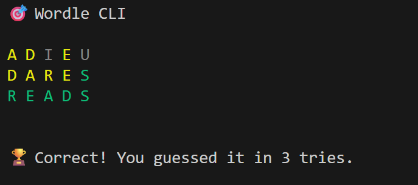

# 🎯 Wordle CLI

A **Terminal-Based Wordle Game** in Python.  
Guess the 5-letter word within 6 tries with color-coded feedback, just like the original Wordle — all in your terminal!

---

## 🧩 Features

- Uses a local `words.txt` file for the word list (offline play)  
- Randomly selects a 5-letter secret word  
- Color-coded feedback for each guess:
  - 🟩 Green = Correct letter, correct position  
  - 🟨 Yellow = Correct letter, wrong position  
  - ⬛ Gray = Letter not in the word   
- Fully CLI — no GUI required  

---

## 🕹️ How To Play

- Clone the repo or Download the folder

- Install requirements
    `pip install -r requirements.txt`

- Run the `WordleCLI.py` file
    `python WordleCLI.py`

- Solve the Wordle

## Sample

